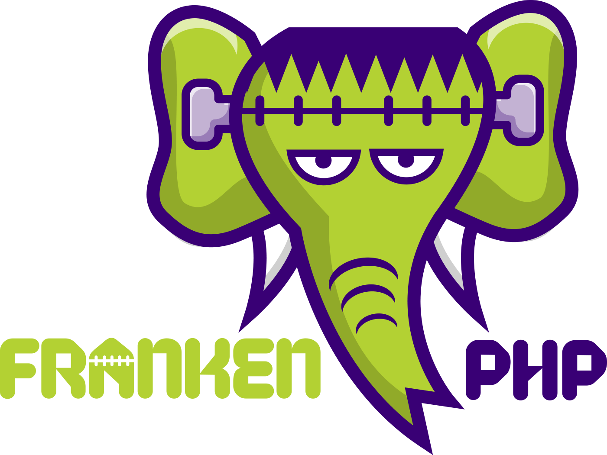

<h1 align="center">AlefDev</h1>
<p align="center"><a href="https://laravel.com" target="_blank"></a></p>

<h1 align="center"><a href="https://frankenphp.dev"></a></h1>

#### Stack:
- Laravel 12 (Octane/FrankenPHP) 
- PostgreSQL
- Redis
- Docker-Compose

#### Dashboards:
- App http://127.0.0.1/
- Pulse (http://127.0.0.1/pulse)
- Horizon (http://127.0.0.1/horizon/dashboard)
- Telescope (http://127.0.0.1/telescope/)
- Swagger UI (http://127.0.0.1/api/documentation)

## Getting Started

### Настройка окружения

1. Скопируйте файл окружения:
```bash
cp -n .env.example .env
```
```bash
cp -n .env.testing.example .env.testing
```
2. Настройте необходимые переменные в `.env`:
```bash
APP_NAMESPACE=value # value - префикс к сервисам docker-compose 
```
3. Инициализация проекта (Docker-Compose):

Makefile:
```bash
make init
```

или

Taskfile (https://taskfile.dev/docs/installation#get-the-binary):
```bash
task init
```
## Тестовое задание

REST API для системы управления студентами, классами и лекциями.
Авторизация и фронтенд не требуются.

### API:
1) получить список всех студентов
2) получить информацию о конкретном студенте (имя, email + класс + прослушанные лекции)
3) создать студента
4) обновить студента (имя, принадлежность к классу)
5) удалить студента

6) получить список всех классов
7) получить информацию о конкретном классе (название + студенты класса)
8) получить учебный план (список лекций) для конкретного класса
9) создать/обновить учебный план (очередность и состав лекций) для конкретного класса
10) создать класс
11) обновить класс (название)
12) удалить класс (при удалении класса, привязанные студенты должны открепляться от класса, но не удаляться полностью из системы)

13) получить список всех лекций
14) получить информацию о конкретной лекции (тема, описание + какие классы прослушали лекцию + какие студенты прослушали лекцию)
15) создать лекцию
16) обновить лекцию (тема, описание)
17) удалить лекцию

### Технические требования:

- Использовать строгую типизацию
- Использовать тесты для API
- Использовать Factory для Model
- Thin controllers
- Использовать пагинацию для маршрутов, в которых запрашивают списки. Прикреплять к ссылкам в ответе данные из запроса
- Если есть сложная бизнес-логика, то ее нужно вынести в сервисы. Сервис должен работать с моделью и реализовывать свои методы на основе методов модели или моделей с дополнением бизнес-логикой
- Результат запроса к API должен возвращаться в формате JSON
- Должна быть реализована валидация передаваемых в запросе к API данных, она должна быть вынесена в реквесты
- В контроллерах и сервисах использовать Dependency Injection
- Использовать жадную загрузку для получения связанных данных (например, при получении информации о студенте необходимо загрузить информацию о классе и лекциях)

### Дополнительные замечания:

- Код должен соответствовать строгим стандартам кодирования и проходить проверки статическим анализатором PHPStan (версия не ниже v2.1)
- Необходимо предусмотреть обработку ошибок и возвращать информативные сообщения об ошибках в формате JSON
- Следует использовать Eloquent ORM для работы с базой данных
- Для валидации данных использовать Request classes в Laravel
- Реализовать логирование запросов и ошибок
- Использовать DTO для работы с пользовательскими данными


### Commonly used tasks

```bash
make/task exec # контейнер laravel
```
```bash
make/task up
```
```bash
make/task stop
```
```bash
make/task tink
```
```bash
make/task check # проверка качества кода
```


## Code quality: 
```bash
make check
```
или
```bash
task check
```
